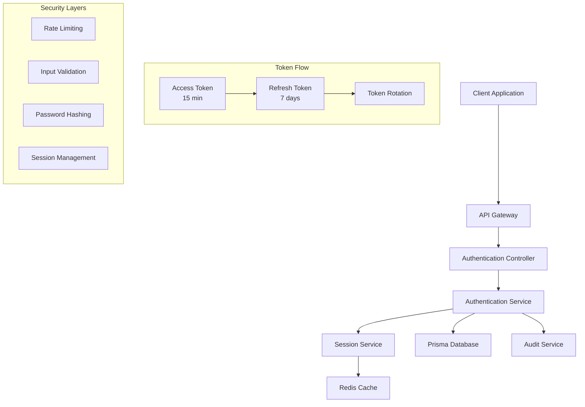
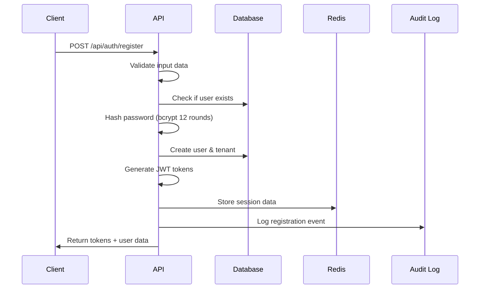
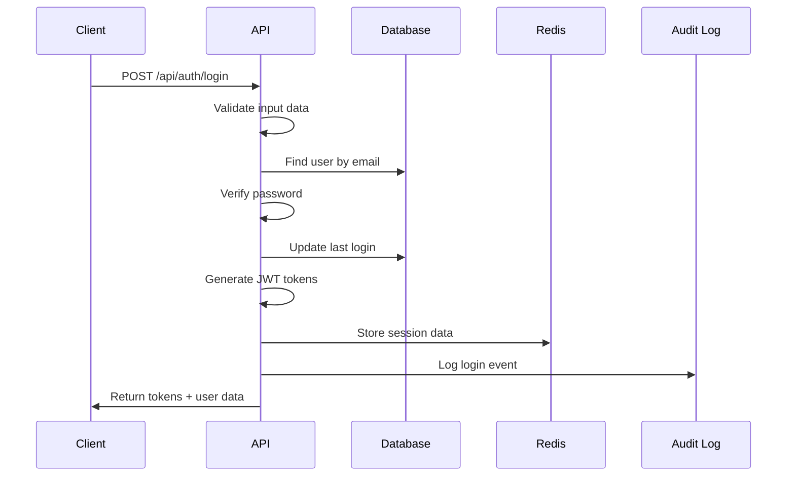
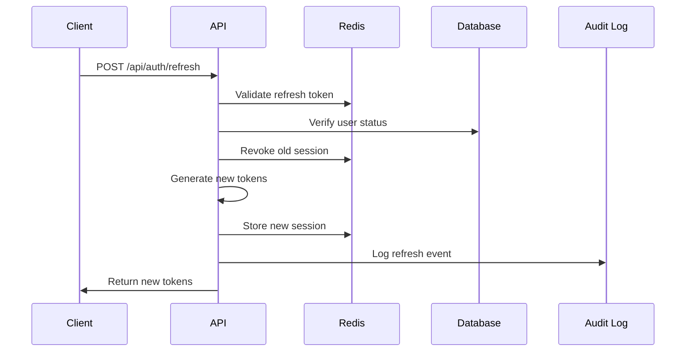
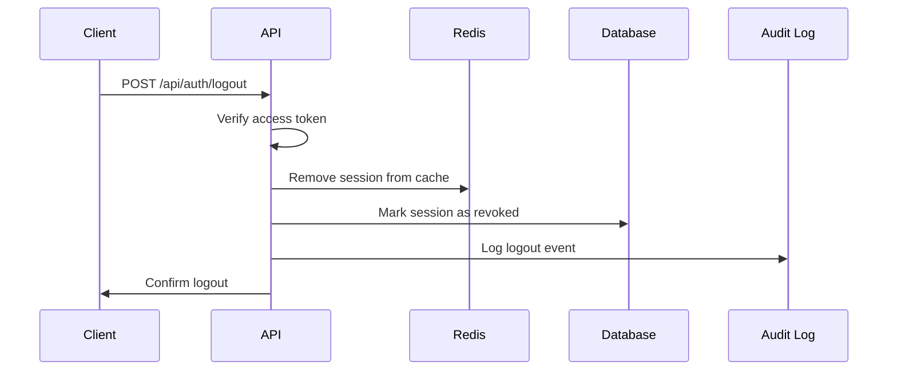

# Authentication System Documentation

## Overview

The PE Investor Portal implements a robust JWT-based authentication system with advanced security features including refresh token rotation, session management, and comprehensive audit logging.

## Architecture



## Authentication Flow

### 1. User Registration



### 2. User Login



### 3. Token Refresh



### 4. Logout Process



## Token Structure

### Access Token (JWT)

**Header:**
```json
{
  "alg": "HS256",
  "typ": "JWT"
}
```

**Payload:**
```json
{
  "sub": "user-uuid",
  "email": "user@example.com",
  "tenantId": "tenant-uuid",
  "iat": 1641234567,
  "exp": 1641235467
}
```

**Expiration:** 15 minutes

### Refresh Token (JWT)

**Payload:**
```json
{
  "sub": "user-uuid",
  "type": "refresh",
  "jti": "unique-token-id",
  "iat": 1641234567,
  "exp": 1641838367
}
```

**Expiration:** 7 days

## Security Features

### 1. Password Security

- **Hashing Algorithm**: bcrypt with 12 rounds
- **Minimum Requirements**: 8 characters minimum
- **Storage**: Only hashed passwords stored in database

```typescript
// Password hashing implementation
const saltRounds = 12;
const hashedPassword = await bcrypt.hash(plainPassword, saltRounds);

// Password verification
const isValid = await bcrypt.compare(plainPassword, hashedPassword);
```

### 2. Token Rotation

- **Access Token**: Regenerated on each refresh
- **Refresh Token**: Rotated on each use (one-time use)
- **Session Invalidation**: Old tokens immediately revoked

### 3. Rate Limiting

| Endpoint | Limit | Window | Rationale |
|----------|-------|---------|-----------|
| `/auth/register` | 5 requests | 5 minutes | Prevent spam registrations |
| `/auth/login` | 10 requests | 15 minutes | Brute force protection |
| `/auth/refresh` | 20 requests | 10 minutes | Normal usage patterns |
| Global | 100 requests | 1 minute | Overall protection |

### 4. Session Management

Sessions are stored in both Redis (fast access) and PostgreSQL (persistence):

**Redis Session Data:**
```json
{
  "userId": "user-uuid",
  "tenantId": "tenant-uuid",
  "userAgent": "Mozilla/5.0...",
  "ipAddress": "192.168.1.1",
  "createdAt": "2025-01-09T10:30:00.000Z"
}
```

**Database Session Record:**
```sql
CREATE TABLE sessions (
  id TEXT PRIMARY KEY,
  user_id TEXT NOT NULL,
  tenant_id TEXT NOT NULL,
  refresh_token TEXT UNIQUE NOT NULL,
  is_revoked BOOLEAN DEFAULT FALSE,
  expires_at TIMESTAMP NOT NULL,
  user_agent TEXT,
  ip_address TEXT,
  created_at TIMESTAMP DEFAULT NOW(),
  updated_at TIMESTAMP DEFAULT NOW()
);
```

## Multi-Tenant Authentication

### Tenant Resolution

The system resolves tenant context through multiple methods:

1. **Explicit Header**: `X-Tenant-ID: tenant-uuid`
2. **JWT Claims**: Automatic from authenticated user
3. **Subdomain**: `tenant.domain.com` (production)
4. **Query Parameter**: `?tenantId=uuid` (fallback)

### Tenant Isolation

- **User Scope**: Users belong to specific tenants
- **Session Scope**: Sessions are tenant-scoped
- **Data Isolation**: All queries filtered by tenant
- **Cross-Tenant Protection**: Automatic validation prevents cross-tenant access

## Audit Logging

### Logged Events

| Event | Trigger | Data Captured |
|-------|---------|---------------|
| `REGISTER` | User registration | User ID, email, tenant, IP, user agent |
| `LOGIN` | Successful login | User ID, tenant, IP, user agent, timestamp |
| `LOGIN_FAILED` | Failed login attempt | Email, IP, user agent, reason |
| `LOGOUT` | User logout | User ID, tenant, session ID |
| `LOGOUT_ALL` | Multi-device logout | User ID, tenant, session count |
| `TOKEN_REFRESH` | Token refresh | User ID, tenant, old/new token IDs |
| `PASSWORD_CHANGE` | Password update | User ID, tenant |
| `ACCOUNT_LOCK` | Account locked | User ID, tenant, reason |

### Audit Log Structure

```typescript
interface AuditLog {
  id: string;
  userId?: string;
  tenantId?: string;
  action: string;
  resource?: string;
  details?: Record<string, any>;
  ipAddress?: string;
  userAgent?: string;
  createdAt: Date;
}
```

### Example Audit Entry

```json
{
  "id": "audit-log-uuid",
  "userId": "user-uuid",
  "tenantId": "tenant-uuid",
  "action": "LOGIN",
  "resource": "AUTH",
  "details": {
    "loginMethod": "email",
    "success": true,
    "sessionId": "session-uuid"
  },
  "ipAddress": "192.168.1.100",
  "userAgent": "Mozilla/5.0 (Windows NT 10.0; Win64; x64) AppleWebKit/537.36",
  "createdAt": "2025-01-09T10:30:00.000Z"
}
```

## Implementation Details

### Authentication Service

```typescript
@Injectable()
export class AuthService {
  async register(dto: RegisterDto): Promise<AuthResponseDto> {
    // 1. Validate input
    // 2. Check user existence
    // 3. Hash password
    // 4. Create user and tenant
    // 5. Generate tokens
    // 6. Create session
    // 7. Log audit event
    // 8. Return response
  }

  async login(dto: LoginDto): Promise<AuthResponseDto> {
    // 1. Find user by email
    // 2. Verify password
    // 3. Update last login
    // 4. Generate tokens
    // 5. Create session
    // 6. Log audit event
    // 7. Return response
  }

  private async generateTokens(payload: JwtPayload): Promise<JwtTokens> {
    const accessToken = await this.jwtService.signAsync(payload, {
      expiresIn: '15m',
      secret: this.configService.get('JWT_SECRET')
    });

    const refreshPayload = {
      sub: payload.sub,
      type: 'refresh',
      jti: randomBytes(16).toString('hex')
    };

    const refreshToken = await this.jwtService.signAsync(refreshPayload, {
      expiresIn: '7d',
      secret: this.configService.get('JWT_REFRESH_SECRET')
    });

    return { accessToken, refreshToken };
  }
}
```

### JWT Strategy

```typescript
@Injectable()
export class JwtStrategy extends PassportStrategy(Strategy) {
  constructor(
    private configService: ConfigService,
    private prisma: PrismaService
  ) {
    super({
      jwtFromRequest: ExtractJwt.fromAuthHeaderAsBearerToken(),
      ignoreExpiration: false,
      secretOrKey: configService.get<string>('JWT_SECRET')
    });
  }

  async validate(payload: JwtPayload): Promise<AuthenticatedUser> {
    const user = await this.prisma.user.findUnique({
      where: { id: payload.sub, isActive: true },
      include: { tenant: true }
    });

    if (!user || !user.tenant.isActive) {
      throw new UnauthorizedException('User not found or inactive');
    }

    return {
      id: user.id,
      email: user.email,
      firstName: user.firstName,
      lastName: user.lastName,
      tenantId: user.tenantId,
      isActive: user.isActive,
      isVerified: user.isVerified
    };
  }
}
```

### Session Service

```typescript
@Injectable()
export class SessionService {
  async createSession(sessionData: SessionData): Promise<void> {
    // Store in database
    await this.prisma.session.create({
      data: {
        userId: sessionData.userId,
        tenantId: sessionData.tenantId,
        refreshToken: sessionData.refreshToken,
        expiresAt: sessionData.expiresAt,
        userAgent: sessionData.userAgent,
        ipAddress: sessionData.ipAddress
      }
    });

    // Store in Redis for fast lookup
    const redisKey = `session:${sessionData.refreshToken}`;
    const ttlSeconds = 7 * 24 * 60 * 60; // 7 days
    await this.redis.set(redisKey, JSON.stringify(sessionData), ttlSeconds);
  }

  async getSession(refreshToken: string): Promise<SessionData | null> {
    // First check Redis
    const redisKey = `session:${refreshToken}`;
    const sessionJson = await this.redis.get(redisKey);

    if (sessionJson) {
      return JSON.parse(sessionJson);
    }

    // Fallback to database
    const session = await this.prisma.session.findUnique({
      where: {
        refreshToken,
        isRevoked: false,
        expiresAt: { gt: new Date() }
      }
    });

    return session ? this.mapToSessionData(session) : null;
  }
}
```

## Configuration

### Environment Variables

```bash
# JWT Configuration
JWT_SECRET=your-super-secure-jwt-secret-256-bit-minimum
JWT_REFRESH_SECRET=your-super-secure-refresh-secret-256-bit-minimum
JWT_EXPIRATION=15m
JWT_REFRESH_EXPIRATION=7d

# Security Configuration
BCRYPT_ROUNDS=12
THROTTLE_TTL=60000
THROTTLE_LIMIT=10

# Session Configuration
SESSION_TIMEOUT=7d
REDIS_URL=redis://localhost:6379

# Multi-tenant Configuration
DEFAULT_TENANT_NAME=Default Organization
ENABLE_SUBDOMAIN_TENANCY=false
```

### Security Headers

The API automatically applies security headers:

```typescript
// Security middleware
res.setHeader('X-Content-Type-Options', 'nosniff');
res.setHeader('X-Frame-Options', 'DENY');
res.setHeader('X-XSS-Protection', '1; mode=block');
res.setHeader('Referrer-Policy', 'strict-origin-when-cross-origin');
res.setHeader('Content-Security-Policy', "default-src 'self'");

// HSTS in production
if (process.env.NODE_ENV === 'production') {
  res.setHeader('Strict-Transport-Security', 'max-age=31536000; includeSubDomains');
}
```

## Best Practices

### For Developers

1. **Always validate tokens** on server-side
2. **Store tokens securely** (httpOnly cookies recommended)
3. **Implement proper error handling** for auth failures
4. **Use HTTPS in production** for all auth endpoints
5. **Monitor authentication metrics** for security analysis

### For Operations

1. **Regular security audits** of authentication logs
2. **Monitor failed login attempts** for brute force attacks
3. **Implement proper backup** for session data
4. **Use environment-specific secrets** (never hardcode)
5. **Regular token secret rotation** for enhanced security

## Troubleshooting

### Common Issues

#### 1. Token Expiration
**Problem**: "Token expired" errors
**Solution**: Implement automatic token refresh logic in client

#### 2. CORS Issues
**Problem**: Auth requests blocked by browser
**Solution**: Configure CORS properly for your domain

#### 3. Rate Limiting
**Problem**: "Too many requests" errors
**Solution**: Implement exponential backoff in client

#### 4. Session Conflicts
**Problem**: Multiple sessions for same user
**Solution**: Use logout-all endpoint or implement session limits

### Debug Tools

#### Check Token Validity
```bash
curl -X GET http://localhost:3000/api/auth/validate \
  -H "Authorization: Bearer YOUR_TOKEN"
```

#### Verify User Session
```bash
curl -X GET http://localhost:3000/api/auth/profile \
  -H "Authorization: Bearer YOUR_TOKEN"
```

#### Test Rate Limits
```bash
for i in {1..15}; do
  curl -X POST http://localhost:3000/api/auth/login \
    -H "Content-Type: application/json" \
    -d '{"email":"test@test.com","password":"wrong"}'
done
```

## Security Considerations

### Threats Mitigated

- **Brute Force Attacks**: Rate limiting and account lockout
- **Token Hijacking**: Short-lived access tokens with rotation
- **Session Fixation**: Fresh tokens on each authentication
- **CSRF Attacks**: Proper token validation and CORS
- **XSS Attacks**: Secure token storage recommendations
- **SQL Injection**: Parameterized queries via Prisma ORM

### Additional Recommendations

1. **Implement 2FA** for high-value accounts
2. **Add device fingerprinting** for suspicious activity detection
3. **Use refresh token families** for enhanced security
4. **Implement IP whitelisting** for administrative accounts
5. **Add geolocation checks** for unusual login patterns

## Monitoring and Metrics

### Key Metrics to Track

- Authentication success/failure rates
- Token refresh frequency
- Session duration patterns
- Failed login attempts by IP
- Geographic distribution of logins
- Device/browser patterns

### Alerting Thresholds

- More than 5 failed logins per user per hour
- More than 20 failed logins per IP per hour
- Unusual geographic login patterns
- High token refresh rates (potential bot activity)
- Mass logout events (potential security breach)