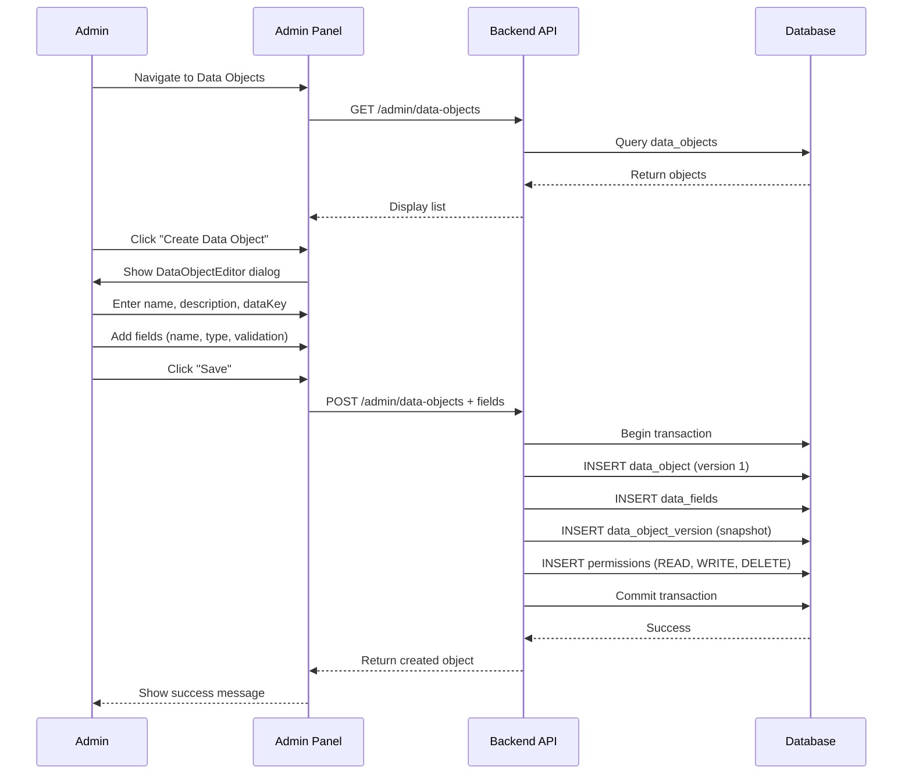
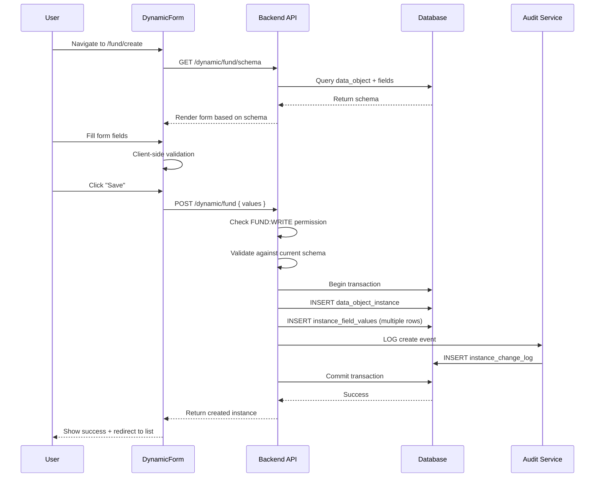
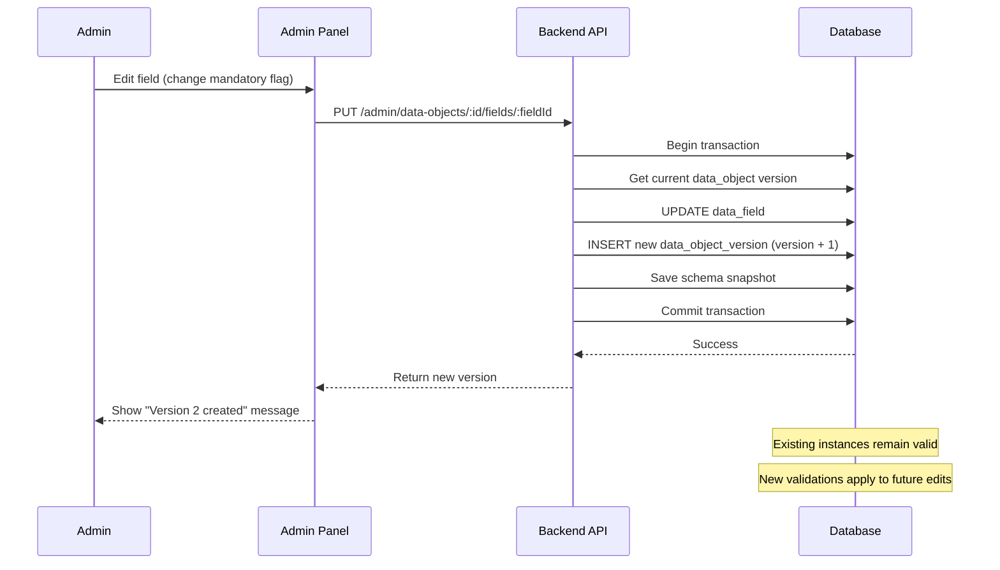
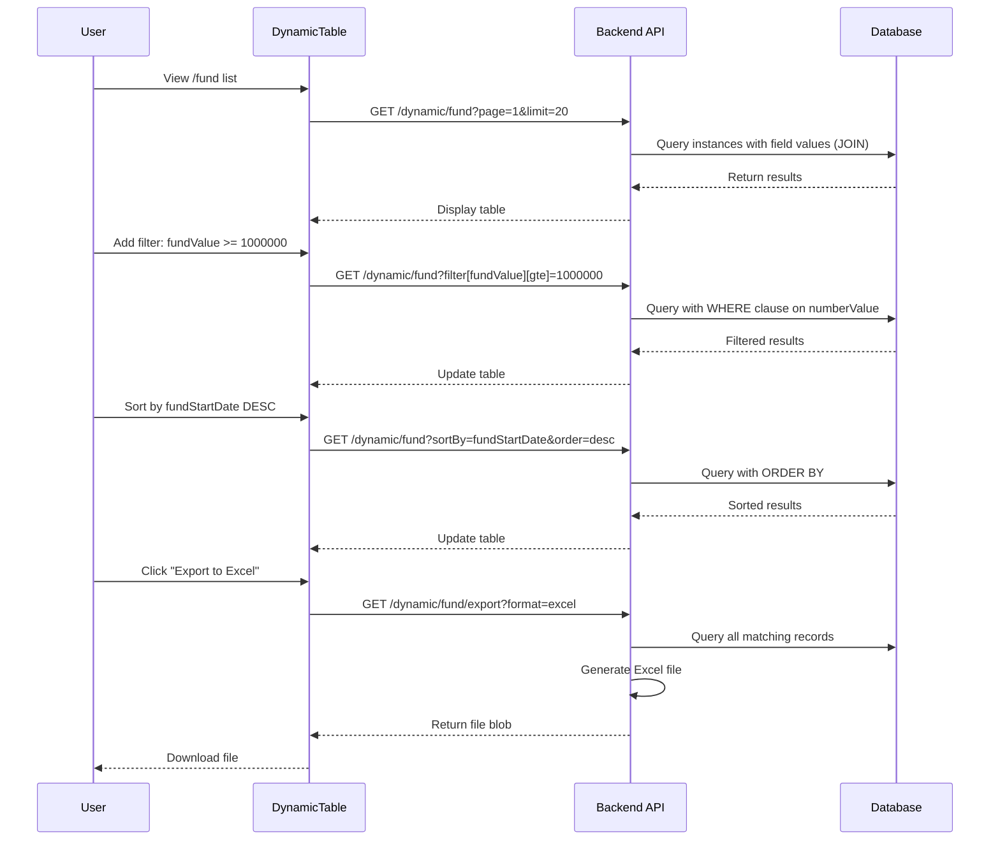

# Dynamic Data Objects Feature - Technical Specification

**Version**: 1.0
**Date**: 2025-10-28
**Status**: Planning Phase
**Author**: Technical Specification Document

---

## Table of Contents
1. [Executive Summary](#executive-summary)
2. [Feature Overview](#feature-overview)
3. [Architecture Design](#architecture-design)
4. [Database Schema Design](#database-schema-design)
5. [API Design](#api-design)
6. [Frontend Components](#frontend-components)
7. [Security & Permissions](#security--permissions)
8. [Data Flow & Workflows](#data-flow--workflows)
9. [Validation Rules](#validation-rules)
10. [Implementation Task Breakdown](#implementation-task-breakdown)

---

## Executive Summary

This document outlines the technical specification for implementing a **Dynamic Data Objects** feature that enables administrators to create configurable data structures and end-users to create instances of those structures through automatically generated forms and tables.

### Key Capabilities
- **Admin-defined schemas**: SUPER_ADMIN users can create data object definitions with custom fields
- **Version control**: Data objects support versioning with historical schema tracking
- **Dynamic UI generation**: Automatic form and table generation based on schema definitions
- **Type-safe data storage**: Entity-Attribute-Value (EAV) pattern for flexible, queryable data storage
- **Comprehensive field types**: Support for 13+ field types including text, numbers, dates, files, relationships, and more
- **Permission-based access**: Resource-action permission model (e.g., FUND:WRITE, FUND:READ)
- **Audit trail**: Complete change tracking for all data modifications
- **Advanced UI features**: Sorting, filtering, searching, pagination, and export capabilities

---

## Feature Overview

### Part 1: Data Object Configuration (Admin Panel)

**Access**: SUPER_ADMIN role only

**Functionality**:
1. Create/Edit/Delete data object definitions
2. Add/Edit/Delete fields for each data object
3. Configure field properties (type, validation, order, etc.)
4. Version management for schema changes

**Example Use Case**:
Admin creates a "Fund" data object with fields: Fund Name (text), Start Date (date), Value (currency), Owner (single-select), Description (textarea).

### Part 2: Data Object Instance Management

**Access**: Users with appropriate permissions (FUND:READ, FUND:WRITE, etc.)

**Functionality**:
1. Dynamically generated forms for creating/editing instances
2. Dynamically generated tables for viewing all instances
3. Search, filter, sort, and export capabilities
4. Validation against current schema rules

**Example Use Case**:
User with FUND:WRITE permission can create fund instances using the auto-generated form. User with FUND:READ can view all funds in a sortable, filterable table.

---

## Architecture Design

### High-Level Architecture

```
┌─────────────────────────────────────────────────────────────────┐
│                         Frontend (Vue 3)                         │
├─────────────────────────────────────────────────────────────────┤
│  Admin Panel Components          │  User Components             │
│  ├─ DataObjectManager.vue        │  ├─ DynamicForm.vue         │
│  ├─ DataObjectEditor.vue         │  ├─ DynamicTable.vue        │
│  ├─ FieldEditor.vue              │  └─ DynamicFilters.vue      │
│  └─ VersionHistory.vue           │                              │
└─────────────────────────────────────────────────────────────────┘
                              │
                              │ REST API
                              ▼
┌─────────────────────────────────────────────────────────────────┐
│                      Backend (NestJS)                            │
├─────────────────────────────────────────────────────────────────┤
│  Admin Module                    │  Dynamic Data Module         │
│  ├─ DataObjectController         │  ├─ DynamicController        │
│  ├─ DataObjectService            │  ├─ DynamicService           │
│  ├─ FieldService                 │  ├─ InstanceService          │
│  └─ VersioningService            │  └─ ValidationService        │
├─────────────────────────────────────────────────────────────────┤
│                      Shared Services                             │
│  ├─ PermissionGuard              │  ├─ AuditService            │
│  └─ ValidationPipe               │  └─ SchemaService           │
└─────────────────────────────────────────────────────────────────┘
                              │
                              ▼
┌─────────────────────────────────────────────────────────────────┐
│                   Database (PostgreSQL + Prisma)                 │
├─────────────────────────────────────────────────────────────────┤
│  ├─ data_objects                 │  ├─ data_object_instances   │
│  ├─ data_object_versions         │  ├─ instance_field_values   │
│  ├─ data_fields                  │  ├─ instance_change_log     │
│  └─ field_validation_rules       │  └─ permissions             │
└─────────────────────────────────────────────────────────────────┘
```

### Storage Pattern: EAV (Entity-Attribute-Value)

The EAV pattern provides:
- ✅ Flexible schema without ALTER TABLE operations
- ✅ Type-safe storage with proper indexing
- ✅ Efficient querying with proper JOIN strategies
- ✅ Field-level validation and constraints
- ✅ Audit trail at field level

---

## Database Schema Design

### Prisma Schema Models

```prisma
// ============================================================================
// DATA OBJECT DEFINITION TABLES
// ============================================================================

model DataObject {
  id          String   @id @default(uuid()) @db.Uuid
  name        String   @db.VarChar(255)
  description String?  @db.Text
  dataKey     String   @unique @db.VarChar(100)  // camelCase identifier
  isActive    Boolean  @default(true)
  createdAt   DateTime @default(now())
  updatedAt   DateTime @updatedAt
  createdBy   String   @db.Uuid
  updatedBy   String   @db.Uuid

  // Relations
  versions    DataObjectVersion[]
  fields      DataField[]
  instances   DataObjectInstance[]
  permissions Permission[]

  // Indexes
  @@index([dataKey])
  @@index([isActive])
  @@map("data_objects")
}

model DataObjectVersion {
  id             String   @id @default(uuid()) @db.Uuid
  dataObjectId   String   @db.Uuid
  version        Int
  name           String   @db.VarChar(255)
  description    String?  @db.Text
  schemaSnapshot Json     // Complete schema at this version
  createdAt      DateTime @default(now())
  createdBy      String   @db.Uuid

  // Relations
  dataObject     DataObject @relation(fields: [dataObjectId], references: [id], onDelete: Cascade)

  // Constraints
  @@unique([dataObjectId, version])
  @@index([dataObjectId])
  @@map("data_object_versions")
}

// ============================================================================
// FIELD DEFINITION TABLES
// ============================================================================

model DataField {
  id              String   @id @default(uuid()) @db.Uuid
  dataObjectId    String   @db.Uuid
  name            String   @db.VarChar(255)
  fieldKey        String   @db.VarChar(100)  // camelCase identifier
  dataType        String   @db.VarChar(50)   // See FieldDataType enum
  fieldOrder      Int      @default(0)
  description     String?  @db.Text
  isMandatory     Boolean  @default(false)
  isReadOnly      Boolean  @default(false)
  isActive        Boolean  @default(true)
  defaultValue    String?  @db.Text
  createdAt       DateTime @default(now())
  updatedAt       DateTime @updatedAt
  createdBy       String   @db.Uuid
  updatedBy       String   @db.Uuid

  // Relations
  dataObject      DataObject @relation(fields: [dataObjectId], references: [id], onDelete: Cascade)
  validationRules FieldValidationRule[]
  dropdownOptions FieldDropdownOption[]
  fieldValues     InstanceFieldValue[]

  // Constraints
  @@unique([dataObjectId, fieldKey])
  @@index([dataObjectId])
  @@index([fieldKey])
  @@index([fieldOrder])
  @@map("data_fields")
}

model FieldValidationRule {
  id          String   @id @default(uuid()) @db.Uuid
  fieldId     String   @db.Uuid
  ruleType    String   @db.VarChar(50)   // minLength, maxLength, minValue, maxValue, regex, custom
  ruleValue   String   @db.Text
  errorMessage String  @db.Text
  createdAt   DateTime @default(now())

  // Relations
  field       DataField @relation(fields: [fieldId], references: [id], onDelete: Cascade)

  @@index([fieldId])
  @@map("field_validation_rules")
}

model FieldDropdownOption {
  id          String   @id @default(uuid()) @db.Uuid
  fieldId     String   @db.Uuid
  label       String   @db.VarChar(255)
  value       String   @db.VarChar(255)
  orderIndex  Int      @default(0)
  isActive    Boolean  @default(true)
  createdAt   DateTime @default(now())

  // Relations
  field       DataField @relation(fields: [fieldId], references: [id], onDelete: Cascade)

  @@index([fieldId])
  @@index([orderIndex])
  @@map("field_dropdown_options")
}

// ============================================================================
// DATA INSTANCE TABLES (EAV Pattern)
// ============================================================================

model DataObjectInstance {
  id             String   @id @default(uuid()) @db.Uuid
  dataObjectId   String   @db.Uuid
  versionNumber  Int      // Schema version when created
  isActive       Boolean  @default(true)
  createdAt      DateTime @default(now())
  updatedAt      DateTime @updatedAt
  createdBy      String   @db.Uuid
  updatedBy      String   @db.Uuid

  // Relations
  dataObject     DataObject @relation(fields: [dataObjectId], references: [id], onDelete: Restrict)
  fieldValues    InstanceFieldValue[]
  changeLog      InstanceChangeLog[]

  @@index([dataObjectId])
  @@index([createdAt])
  @@index([isActive])
  @@map("data_object_instances")
}

model InstanceFieldValue {
  id              String   @id @default(uuid()) @db.Uuid
  instanceId      String   @db.Uuid
  fieldId         String   @db.Uuid

  // Type-specific storage columns
  textValue       String?  @db.Text
  numberValue     Decimal? @db.Decimal(20, 4)
  dateValue       DateTime?
  booleanValue    Boolean?
  jsonValue       Json?    // For complex types (file metadata, rich text, etc.)

  createdAt       DateTime @default(now())
  updatedAt       DateTime @updatedAt

  // Relations
  instance        DataObjectInstance @relation(fields: [instanceId], references: [id], onDelete: Cascade)
  field           DataField @relation(fields: [fieldId], references: [id], onDelete: Restrict)

  // Constraints
  @@unique([instanceId, fieldId])
  @@index([instanceId])
  @@index([fieldId])
  @@index([textValue(length: 255)])  // For text searches
  @@index([numberValue])
  @@index([dateValue])
  @@map("instance_field_values")
}

// ============================================================================
// AUDIT & CHANGE TRACKING
// ============================================================================

model InstanceChangeLog {
  id              String   @id @default(uuid()) @db.Uuid
  instanceId      String   @db.Uuid
  fieldId         String?  @db.Uuid  // null means instance-level change
  changeType      String   @db.VarChar(50)  // CREATE, UPDATE, DELETE
  oldValue        String?  @db.Text
  newValue        String?  @db.Text
  changedAt       DateTime @default(now())
  changedBy       String   @db.Uuid

  // Relations
  instance        DataObjectInstance @relation(fields: [instanceId], references: [id], onDelete: Cascade)

  @@index([instanceId])
  @@index([changedAt])
  @@index([changedBy])
  @@map("instance_change_log")
}

// ============================================================================
// PERMISSIONS (Extends existing Permission model)
// ============================================================================

// Add to existing Permission model or create relation
// Format: {dataKey}:READ, {dataKey}:WRITE, {dataKey}:DELETE
// Example: FUND:READ, FUND:WRITE, FUND:DELETE
```

### Field Data Types Enum

```typescript
export enum FieldDataType {
  TEXT = 'TEXT',                    // Single-line text input
  TEXTAREA = 'TEXTAREA',            // Multi-line text input
  NUMBER = 'NUMBER',                // Numeric input
  CURRENCY = 'CURRENCY',            // Money with currency code
  DATE = 'DATE',                    // Date picker
  DATETIME = 'DATETIME',            // Date + time picker
  BOOLEAN = 'BOOLEAN',              // Checkbox/toggle
  SINGLE_SELECT = 'SINGLE_SELECT',  // Dropdown (single choice)
  MULTI_SELECT = 'MULTI_SELECT',    // Dropdown (multiple choices)
  EMAIL = 'EMAIL',                  // Email with validation
  URL = 'URL',                      // URL with validation
  FILE = 'FILE',                    // File upload
  RICH_TEXT = 'RICH_TEXT',          // WYSIWYG editor
  RELATIONSHIP = 'RELATIONSHIP',     // Link to another data object instance
}
```

---

## API Design

### Admin API Endpoints (Data Object Management)

#### 1. Data Object CRUD

```typescript
// Create Data Object
POST /api/v1/admin/data-objects
Headers: Authorization: Bearer {token}
Body: {
  "name": "Fund",
  "description": "PE fund management",
  "dataKey": "fund"
}
Response: {
  "id": "uuid",
  "name": "Fund",
  "description": "PE fund management",
  "dataKey": "fund",
  "version": 1,
  "createdAt": "2025-10-28T10:00:00Z"
}

// Get All Data Objects
GET /api/v1/admin/data-objects
Response: {
  "items": [
    {
      "id": "uuid",
      "name": "Fund",
      "dataKey": "fund",
      "version": 1,
      "fieldCount": 5,
      "instanceCount": 12,
      "createdAt": "2025-10-28T10:00:00Z"
    }
  ],
  "total": 1
}

// Get Single Data Object with Fields
GET /api/v1/admin/data-objects/:id
Response: {
  "id": "uuid",
  "name": "Fund",
  "description": "PE fund management",
  "dataKey": "fund",
  "version": 3,
  "isActive": true,
  "fields": [
    {
      "id": "uuid",
      "name": "Fund Name",
      "fieldKey": "fundName",
      "dataType": "TEXT",
      "fieldOrder": 1,
      "isMandatory": true,
      "isReadOnly": false,
      "validationRules": [
        {
          "ruleType": "minLength",
          "ruleValue": "3",
          "errorMessage": "Fund name must be at least 3 characters"
        }
      ]
    }
  ],
  "createdAt": "2025-10-28T10:00:00Z",
  "updatedAt": "2025-10-28T12:00:00Z"
}

// Update Data Object (creates new version)
PUT /api/v1/admin/data-objects/:id
Body: {
  "name": "Fund Updated",
  "description": "Updated description"
}
Response: {
  "id": "uuid",
  "version": 2,
  "message": "Data object updated. New version created."
}

// Delete Data Object
DELETE /api/v1/admin/data-objects/:id
Response: { "message": "Data object deleted successfully" }
```

#### 2. Field Management

```typescript
// Add Field to Data Object
POST /api/v1/admin/data-objects/:dataObjectId/fields
Body: {
  "name": "Fund Name",
  "fieldKey": "fundName",
  "dataType": "TEXT",
  "fieldOrder": 1,
  "description": "Name of the fund",
  "isMandatory": true,
  "isReadOnly": false,
  "validationRules": [
    {
      "ruleType": "minLength",
      "ruleValue": "3",
      "errorMessage": "Must be at least 3 characters"
    }
  ]
}
Response: {
  "id": "uuid",
  "name": "Fund Name",
  "fieldKey": "fundName",
  "dataType": "TEXT",
  "message": "New version created with added field"
}

// Update Field (creates new version)
PUT /api/v1/admin/data-objects/:dataObjectId/fields/:fieldId
Body: {
  "name": "Fund Name Updated",
  "isMandatory": false
}
Response: {
  "id": "uuid",
  "version": 2,
  "message": "Field updated. New version created."
}

// Delete Field (creates new version)
DELETE /api/v1/admin/data-objects/:dataObjectId/fields/:fieldId
Response: { "message": "Field deleted. New version created." }

// Add Dropdown Options (for SINGLE_SELECT or MULTI_SELECT)
POST /api/v1/admin/fields/:fieldId/options
Body: {
  "options": [
    { "label": "Option 1", "value": "opt1", "orderIndex": 1 },
    { "label": "Option 2", "value": "opt2", "orderIndex": 2 }
  ]
}
Response: { "message": "Options added successfully" }
```

#### 3. Version Management

```typescript
// Get Version History
GET /api/v1/admin/data-objects/:id/versions
Response: {
  "versions": [
    {
      "version": 3,
      "createdAt": "2025-10-28T12:00:00Z",
      "createdBy": "user-uuid",
      "changes": "Added field: Fund Manager"
    },
    {
      "version": 2,
      "createdAt": "2025-10-28T11:00:00Z",
      "createdBy": "user-uuid",
      "changes": "Updated field: Fund Name (made optional)"
    }
  ]
}

// Get Specific Version Schema
GET /api/v1/admin/data-objects/:id/versions/:version
Response: {
  "version": 2,
  "schemaSnapshot": { /* complete schema at that version */ },
  "createdAt": "2025-10-28T11:00:00Z"
}
```

### Dynamic Data API Endpoints (Instance Management)

#### 1. Schema Retrieval

```typescript
// Get Schema for Form/Table Generation
GET /api/v1/dynamic/:dataKey/schema
Example: GET /api/v1/dynamic/fund/schema
Response: {
  "dataObjectId": "uuid",
  "dataKey": "fund",
  "name": "Fund",
  "description": "PE fund management",
  "version": 3,
  "fields": [
    {
      "id": "uuid",
      "fieldKey": "fundName",
      "name": "Fund Name",
      "dataType": "TEXT",
      "fieldOrder": 1,
      "isMandatory": true,
      "isReadOnly": false,
      "description": "Name of the fund",
      "validationRules": [
        {
          "ruleType": "minLength",
          "ruleValue": "3",
          "errorMessage": "Must be at least 3 characters"
        }
      ]
    },
    {
      "id": "uuid",
      "fieldKey": "fundType",
      "name": "Fund Type",
      "dataType": "SINGLE_SELECT",
      "fieldOrder": 2,
      "isMandatory": true,
      "dropdownOptions": [
        { "label": "Venture Capital", "value": "vc" },
        { "label": "Private Equity", "value": "pe" }
      ]
    }
  ],
  "permissions": {
    "canRead": true,
    "canWrite": true,
    "canDelete": false
  }
}
```

#### 2. Instance CRUD

```typescript
// Create Instance
POST /api/v1/dynamic/:dataKey
Example: POST /api/v1/dynamic/fund
Body: {
  "fundName": "OPC II",
  "fundDescription": "Fund of OPC",
  "fundStartDate": "1981-10-12",
  "fundValue": 1000000.00,
  "fundOwner": "Jeremy Billay"
}
Response: {
  "id": "uuid",
  "dataObjectId": "uuid",
  "versionNumber": 3,
  "values": {
    "fundName": "OPC II",
    "fundDescription": "Fund of OPC",
    "fundStartDate": "1981-10-12",
    "fundValue": 1000000.00,
    "fundOwner": "Jeremy Billay"
  },
  "createdAt": "2025-10-28T10:00:00Z",
  "createdBy": "user-uuid"
}

// Get All Instances with Filtering, Sorting, Pagination
GET /api/v1/dynamic/:dataKey?page=1&limit=20&sortBy=fundName&sortOrder=asc&search=OPC
Response: {
  "items": [
    {
      "id": "uuid",
      "values": {
        "fundName": "OPC II",
        "fundDescription": "Fund of OPC",
        "fundStartDate": "1981-10-12",
        "fundValue": 1000000.00,
        "fundOwner": "Jeremy Billay"
      },
      "createdAt": "2025-10-28T10:00:00Z",
      "updatedAt": "2025-10-28T10:00:00Z"
    }
  ],
  "pagination": {
    "total": 50,
    "page": 1,
    "limit": 20,
    "totalPages": 3
  }
}

// Get Single Instance
GET /api/v1/dynamic/:dataKey/:instanceId
Response: {
  "id": "uuid",
  "dataObjectId": "uuid",
  "versionNumber": 3,
  "values": {
    "fundName": "OPC II",
    "fundDescription": "Fund of OPC",
    "fundStartDate": "1981-10-12",
    "fundValue": 1000000.00,
    "fundOwner": "Jeremy Billay"
  },
  "createdAt": "2025-10-28T10:00:00Z",
  "updatedAt": "2025-10-28T10:00:00Z",
  "createdBy": "user-uuid",
  "updatedBy": "user-uuid"
}

// Update Instance (validates against current schema)
PUT /api/v1/dynamic/:dataKey/:instanceId
Body: {
  "fundValue": 1500000.00,
  "fundDescription": "Updated description"
}
Response: {
  "id": "uuid",
  "message": "Instance updated successfully",
  "updatedAt": "2025-10-28T12:00:00Z"
}

// Delete Instance
DELETE /api/v1/dynamic/:dataKey/:instanceId
Response: { "message": "Instance deleted successfully" }
```

#### 3. Advanced Queries

```typescript
// Advanced Filtering
POST /api/v1/dynamic/:dataKey/search
Body: {
  "filters": [
    {
      "fieldKey": "fundValue",
      "operator": "gte",  // gte, lte, eq, neq, contains, startsWith
      "value": 1000000
    },
    {
      "fieldKey": "fundStartDate",
      "operator": "between",
      "value": ["2010-01-01", "2020-12-31"]
    }
  ],
  "sortBy": "fundValue",
  "sortOrder": "desc",
  "page": 1,
  "limit": 20
}
Response: { /* paginated results */ }

// Export to CSV/Excel
GET /api/v1/dynamic/:dataKey/export?format=csv&filters={...}
Response: File download (CSV or Excel)

// Get Change History for Instance
GET /api/v1/dynamic/:dataKey/:instanceId/history
Response: {
  "changes": [
    {
      "id": "uuid",
      "fieldName": "Fund Value",
      "oldValue": "1000000.00",
      "newValue": "1500000.00",
      "changedAt": "2025-10-28T12:00:00Z",
      "changedBy": "user-uuid",
      "changedByName": "John Doe"
    }
  ]
}
```

---

## Frontend Components

### Admin Panel Components

#### 1. DataObjectManager.vue
**Path**: `app/frontend/src/views/admin/DataObjectManager.vue`

**Purpose**: Main view for managing data objects

**Features**:
- List all data objects with search/filter
- Create new data object button
- Edit/Delete actions for each object
- Show field count and instance count
- Version indicator

**Key Composables**:
```typescript
import { useDataObjects } from '@/composables/useDataObjects'
import { usePermissions } from '@/composables/usePermissions'

const {
  dataObjects,
  loading,
  createDataObject,
  deleteDataObject,
  fetchDataObjects
} = useDataObjects()
```

#### 2. DataObjectEditor.vue
**Path**: `app/frontend/src/components/admin/DataObjectEditor.vue`

**Purpose**: Dialog for creating/editing data objects and their fields

**Features**:
- Two-step wizard: 1) Data object details, 2) Field configuration
- Field list with drag-and-drop reordering
- Add/Edit/Delete fields
- Field validation rule configuration
- Dropdown option management
- Version history view
- Real-time validation

**Sections**:
- Basic Info: name, description, dataKey
- Fields Configuration: field list with inline editing
- Validation Rules: per-field validation setup
- Preview: show how the form will look

#### 3. FieldEditor.vue
**Path**: `app/frontend/src/components/admin/FieldEditor.vue`

**Purpose**: Dialog for adding/editing a single field

**Features**:
- Field type selector with icon/description
- Field properties form (name, key, order, mandatory, readonly)
- Validation rules builder
- Dropdown options editor (for select types)
- Default value configuration
- Field preview

#### 4. VersionHistory.vue
**Path**: `app/frontend/src/components/admin/VersionHistory.vue`

**Purpose**: Display version history of a data object

**Features**:
- Timeline view of versions
- Show changes for each version
- View full schema snapshot for any version
- Creator and timestamp information

### User-Facing Components

#### 1. DynamicForm.vue
**Path**: `app/frontend/src/components/dynamic/DynamicForm.vue`

**Purpose**: Auto-generated form for creating/editing instances

**Props**:
```typescript
interface Props {
  dataKey: string           // e.g., 'fund'
  instanceId?: string       // For editing existing instance
  mode: 'create' | 'edit'
}
```

**Features**:
- Fetch schema and render appropriate input components
- Client-side validation based on schema rules
- Server-side validation on submit
- Field dependencies and conditional display
- Loading states and error handling
- Auto-save draft (optional)

**Field Rendering Logic**:
```typescript
const renderField = (field: DataField) => {
  switch (field.dataType) {
    case 'TEXT': return <InputText />
    case 'TEXTAREA': return <Textarea />
    case 'NUMBER': return <InputNumber />
    case 'CURRENCY': return <CurrencyInput />
    case 'DATE': return <Calendar />
    case 'BOOLEAN': return <Checkbox />
    case 'SINGLE_SELECT': return <Dropdown />
    case 'MULTI_SELECT': return <MultiSelect />
    case 'EMAIL': return <InputText type="email" />
    case 'URL': return <InputText type="url" />
    case 'FILE': return <FileUpload />
    case 'RICH_TEXT': return <Editor />
    case 'RELATIONSHIP': return <RelationshipPicker />
  }
}
```

#### 2. DynamicTable.vue
**Path**: `app/frontend/src/components/dynamic/DynamicTable.vue`

**Purpose**: Auto-generated table for displaying all instances

**Props**:
```typescript
interface Props {
  dataKey: string           // e.g., 'fund'
  selectable?: boolean      // Allow row selection
  exportable?: boolean      // Show export button
}
```

**Features**:
- Fetch schema and instances
- Dynamic columns based on fields
- Column visibility toggle
- Sorting (multi-column)
- Filtering (per-column filters)
- Global search
- Pagination (cursor-based)
- Row actions: View, Edit, Delete
- Bulk actions (if selectable)
- Export to CSV/Excel
- Responsive design (mobile-friendly)

**PrimeVue DataTable Integration**:
```vue
<DataTable
  :value="instances"
  :loading="loading"
  paginator
  :rows="20"
  :totalRecords="totalRecords"
  lazy
  @page="onPage"
  @sort="onSort"
  @filter="onFilter"
  filterDisplay="row"
  :globalFilterFields="searchableFields"
  sortMode="multiple"
  removableSort
  resizableColumns
  columnResizeMode="expand"
  showGridlines
  stripedRows
>
  <Column
    v-for="field in visibleFields"
    :key="field.fieldKey"
    :field="field.fieldKey"
    :header="field.name"
    :sortable="true"
    :filter="true"
  >
    <template #body="{ data }">
      <DynamicCellRenderer :field="field" :value="data.values[field.fieldKey]" />
    </template>
    <template #filter="{ filterModel, filterCallback }">
      <DynamicFilter
        :field="field"
        v-model="filterModel.value"
        @change="filterCallback"
      />
    </template>
  </Column>

  <Column header="Actions" :exportable="false">
    <template #body="{ data }">
      <Button icon="pi pi-pencil" @click="editInstance(data)" />
      <Button icon="pi pi-trash" @click="deleteInstance(data)" />
    </template>
  </Column>
</DataTable>
```

#### 3. DynamicFilters.vue
**Path**: `app/frontend/src/components/dynamic/DynamicFilters.vue`

**Purpose**: Advanced filter panel for table

**Features**:
- Add multiple filter criteria
- Field selector
- Operator selector (based on field type)
- Value input (typed based on field)
- AND/OR logic
- Save filter presets
- Clear all filters

#### 4. DynamicCellRenderer.vue
**Path**: `app/frontend/src/components/dynamic/DynamicCellRenderer.vue`

**Purpose**: Render cell value based on field type

**Features**:
- Format currency with symbol
- Format dates according to locale
- Render boolean as icons
- Show file download link
- Truncate long text with tooltip
- Display relationship links

### Shared Composables

#### useDataObjects.ts
```typescript
export function useDataObjects() {
  const dataObjects = ref<DataObject[]>([])
  const loading = ref(false)
  const error = ref<string | null>(null)

  const fetchDataObjects = async () => {
    loading.value = true
    try {
      const response = await api.get('/admin/data-objects')
      dataObjects.value = response.data.items
    } catch (e) {
      error.value = e.message
    } finally {
      loading.value = false
    }
  }

  const createDataObject = async (data: CreateDataObjectDto) => {
    const response = await api.post('/admin/data-objects', data)
    await fetchDataObjects()
    return response.data
  }

  // ... more methods

  return {
    dataObjects,
    loading,
    error,
    fetchDataObjects,
    createDataObject,
    // ... more
  }
}
```

#### useDynamicSchema.ts
```typescript
export function useDynamicSchema(dataKey: string) {
  const schema = ref<DynamicSchema | null>(null)
  const loading = ref(false)

  const fetchSchema = async () => {
    loading.value = true
    try {
      const response = await api.get(`/dynamic/${dataKey}/schema`)
      schema.value = response.data
    } finally {
      loading.value = false
    }
  }

  const getFieldValidators = (field: DataField) => {
    const validators = []
    if (field.isMandatory) {
      validators.push({ required: true, message: `${field.name} is required` })
    }
    // Add more validators based on validation rules
    return validators
  }

  return { schema, loading, fetchSchema, getFieldValidators }
}
```

#### useDynamicInstances.ts
```typescript
export function useDynamicInstances(dataKey: string) {
  const instances = ref<DynamicInstance[]>([])
  const totalRecords = ref(0)
  const loading = ref(false)

  const fetchInstances = async (params: QueryParams) => {
    loading.value = true
    try {
      const response = await api.get(`/dynamic/${dataKey}`, { params })
      instances.value = response.data.items
      totalRecords.value = response.data.pagination.total
    } finally {
      loading.value = false
    }
  }

  const createInstance = async (data: Record<string, any>) => {
    const response = await api.post(`/dynamic/${dataKey}`, data)
    await fetchInstances({})
    return response.data
  }

  const updateInstance = async (id: string, data: Record<string, any>) => {
    const response = await api.put(`/dynamic/${dataKey}/${id}`, data)
    await fetchInstances({})
    return response.data
  }

  const deleteInstance = async (id: string) => {
    await api.delete(`/dynamic/${dataKey}/${id}`)
    await fetchInstances({})
  }

  const exportInstances = async (format: 'csv' | 'excel', filters?: any) => {
    const response = await api.get(`/dynamic/${dataKey}/export`, {
      params: { format, ...filters },
      responseType: 'blob'
    })
    // Handle file download
    const url = window.URL.createObjectURL(new Blob([response.data]))
    const link = document.createElement('a')
    link.href = url
    link.setAttribute('download', `${dataKey}_export.${format}`)
    document.body.appendChild(link)
    link.click()
    link.remove()
  }

  return {
    instances,
    totalRecords,
    loading,
    fetchInstances,
    createInstance,
    updateInstance,
    deleteInstance,
    exportInstances
  }
}
```

---

## Security & Permissions

### Permission Model

Each data object gets three standard permissions:
- `{dataKey}:READ` - View instances
- `{dataKey}:WRITE` - Create/Edit instances
- `{dataKey}:DELETE` - Delete instances

**Example**: For "Fund" data object with dataKey "fund":
- `FUND:READ`
- `FUND:WRITE`
- `FUND:DELETE`

### Permission Guards

#### Backend Guards

```typescript
// Permission guard for admin endpoints
@UseGuards(PermissionGuard)
@RequirePermission('ADMIN:DATA_OBJECTS')
@Controller('admin/data-objects')
export class DataObjectController {
  // ... endpoints
}

// Dynamic permission guard
@UseGuards(DynamicPermissionGuard)
@Controller('dynamic/:dataKey')
export class DynamicController {
  @Get()
  @RequireDynamicPermission('READ')
  async getInstances(@Param('dataKey') dataKey: string) {
    // Permission check: {dataKey.toUpperCase()}:READ
  }

  @Post()
  @RequireDynamicPermission('WRITE')
  async createInstance(@Param('dataKey') dataKey: string) {
    // Permission check: {dataKey.toUpperCase()}:WRITE
  }
}
```

#### Frontend Permission Checks

```typescript
// In components
import { usePermissions } from '@/composables/usePermissions'

const { hasPermission } = usePermissions()

const canEdit = computed(() =>
  hasPermission(`${dataKey.toUpperCase()}:WRITE`)
)

// In router guards
router.beforeEach((to, from, next) => {
  if (to.meta.requiredPermission) {
    if (!hasPermission(to.meta.requiredPermission)) {
      next({ name: 'Forbidden' })
      return
    }
  }
  next()
})
```

### Data Validation Security

#### Input Sanitization

```typescript
// Backend validation pipe
@Injectable()
export class DynamicValidationPipe implements PipeTransform {
  async transform(value: any, metadata: ArgumentMetadata) {
    // 1. Sanitize inputs (XSS prevention)
    const sanitized = DOMPurify.sanitize(value)

    // 2. Validate against schema
    const schema = await this.schemaService.getSchema(dataKey)
    const errors = await this.validateAgainstSchema(sanitized, schema)

    if (errors.length > 0) {
      throw new ValidationException(errors)
    }

    return sanitized
  }
}
```

#### Field-Level Validation

```typescript
// Validation service
export class ValidationService {
  async validateFieldValue(
    field: DataField,
    value: any
  ): Promise<ValidationError[]> {
    const errors: ValidationError[] = []

    // Mandatory check
    if (field.isMandatory && !value) {
      errors.push({ field: field.fieldKey, message: `${field.name} is required` })
    }

    // Type validation
    if (!this.validateType(field.dataType, value)) {
      errors.push({ field: field.fieldKey, message: `Invalid type for ${field.name}` })
    }

    // Custom validation rules
    for (const rule of field.validationRules) {
      const ruleError = await this.validateRule(rule, value)
      if (ruleError) errors.push(ruleError)
    }

    return errors
  }

  private validateRule(rule: FieldValidationRule, value: any): ValidationError | null {
    switch (rule.ruleType) {
      case 'minLength':
        if (value.length < parseInt(rule.ruleValue)) {
          return { field: field.fieldKey, message: rule.errorMessage }
        }
        break
      case 'maxLength':
        if (value.length > parseInt(rule.ruleValue)) {
          return { field: field.fieldKey, message: rule.errorMessage }
        }
        break
      case 'minValue':
        if (value < parseFloat(rule.ruleValue)) {
          return { field: field.fieldKey, message: rule.errorMessage }
        }
        break
      case 'regex':
        const regex = new RegExp(rule.ruleValue)
        if (!regex.test(value)) {
          return { field: field.fieldKey, message: rule.errorMessage }
        }
        break
      // ... more rule types
    }
    return null
  }
}
```

---

## Data Flow & Workflows

### Workflow 1: Admin Creates Data Object



### Workflow 2: User Creates Instance



### Workflow 3: Admin Updates Field (New Version)



### Workflow 4: User Searches and Filters Instances



---

## Validation Rules

### Client-Side Validation (Vue/VeeValidate)

```typescript
// Validation schema builder
export function buildValidationSchema(schema: DynamicSchema) {
  const validationSchema: Record<string, any> = {}

  for (const field of schema.fields) {
    const rules = []

    // Mandatory
    if (field.isMandatory) {
      rules.push(required(field.name))
    }

    // Type-specific validation
    switch (field.dataType) {
      case 'EMAIL':
        rules.push(email())
        break
      case 'URL':
        rules.push(url())
        break
      case 'NUMBER':
        rules.push(numeric())
        break
      // ... more types
    }

    // Custom validation rules
    for (const rule of field.validationRules) {
      rules.push(buildCustomValidator(rule))
    }

    validationSchema[field.fieldKey] = rules
  }

  return validationSchema
}

// Custom validator builder
function buildCustomValidator(rule: ValidationRule) {
  return (value: any) => {
    switch (rule.ruleType) {
      case 'minLength':
        return value.length >= parseInt(rule.ruleValue) || rule.errorMessage
      case 'maxLength':
        return value.length <= parseInt(rule.ruleValue) || rule.errorMessage
      case 'regex':
        return new RegExp(rule.ruleValue).test(value) || rule.errorMessage
      // ... more rules
    }
  }
}
```

### Server-Side Validation (NestJS)

```typescript
// DTO with dynamic validation
export class CreateInstanceDto {
  @IsObject()
  values: Record<string, any>
}

// Validation service
@Injectable()
export class InstanceValidationService {
  async validate(
    dataObjectId: string,
    values: Record<string, any>
  ): Promise<ValidationResult> {
    const schema = await this.schemaService.getSchemaById(dataObjectId)
    const errors: ValidationError[] = []

    // Check all mandatory fields are present
    for (const field of schema.fields.filter(f => f.isMandatory)) {
      if (!(field.fieldKey in values) || values[field.fieldKey] === null) {
        errors.push({
          field: field.fieldKey,
          message: `${field.name} is required`
        })
      }
    }

    // Validate each provided value
    for (const [fieldKey, value] of Object.entries(values)) {
      const field = schema.fields.find(f => f.fieldKey === fieldKey)

      if (!field) {
        errors.push({
          field: fieldKey,
          message: `Field ${fieldKey} does not exist in schema`
        })
        continue
      }

      // Type validation
      const typeError = this.validateType(field, value)
      if (typeError) errors.push(typeError)

      // Custom rules
      const ruleErrors = await this.validateRules(field, value)
      errors.push(...ruleErrors)
    }

    return {
      isValid: errors.length === 0,
      errors
    }
  }

  private validateType(field: DataField, value: any): ValidationError | null {
    switch (field.dataType) {
      case 'TEXT':
      case 'TEXTAREA':
      case 'EMAIL':
      case 'URL':
        if (typeof value !== 'string') {
          return { field: field.fieldKey, message: `${field.name} must be a string` }
        }
        break
      case 'NUMBER':
      case 'CURRENCY':
        if (typeof value !== 'number' && !isNumeric(value)) {
          return { field: field.fieldKey, message: `${field.name} must be a number` }
        }
        break
      case 'DATE':
      case 'DATETIME':
        if (!isValidDate(value)) {
          return { field: field.fieldKey, message: `${field.name} must be a valid date` }
        }
        break
      case 'BOOLEAN':
        if (typeof value !== 'boolean') {
          return { field: field.fieldKey, message: `${field.name} must be a boolean` }
        }
        break
      // ... more types
    }
    return null
  }
}
```

---

## Implementation Task Breakdown

### Phase 1: Database & Backend Foundation (Week 1)

#### Task 1.1: Database Schema Setup
- [ ] Create Prisma schema models for all tables
- [ ] Write migration files
- [ ] Add indexes for performance
- [ ] Test migration on dev database
- [ ] Seed initial data (optional)

**Files to create/modify**:
- `app/backend/src/database/prisma/schema.prisma`
- `app/backend/src/database/prisma/migrations/`

#### Task 1.2: Create TypeScript Types & DTOs
- [ ] Create types for DataObject, DataField, Instance
- [ ] Create DTOs for create/update operations
- [ ] Create validation decorators
- [ ] Export types from shared package (if applicable)

**Files to create**:
- `app/backend/src/modules/data-objects/dto/create-data-object.dto.ts`
- `app/backend/src/modules/data-objects/dto/update-data-object.dto.ts`
- `app/backend/src/modules/data-objects/dto/create-field.dto.ts`
- `app/backend/src/modules/data-objects/entities/data-object.entity.ts`
- `app/backend/src/modules/dynamic-data/dto/create-instance.dto.ts`
- `app/backend/src/modules/dynamic-data/entities/instance.entity.ts`

#### Task 1.3: Admin Module - Data Object Service
- [ ] Create DataObjectService with CRUD operations
- [ ] Implement versioning logic
- [ ] Create FieldService for field management
- [ ] Implement VersioningService for history
- [ ] Add transaction handling
- [ ] Write unit tests

**Files to create**:
- `app/backend/src/modules/data-objects/services/data-object.service.ts`
- `app/backend/src/modules/data-objects/services/field.service.ts`
- `app/backend/src/modules/data-objects/services/versioning.service.ts`
- `app/backend/src/modules/data-objects/tests/data-object.service.spec.ts`

#### Task 1.4: Admin Module - Controllers & Routes
- [ ] Create DataObjectController with endpoints
- [ ] Add permission guards (SUPER_ADMIN only)
- [ ] Add request validation
- [ ] Add error handling
- [ ] Write integration tests
- [ ] Generate Swagger documentation

**Files to create**:
- `app/backend/src/modules/data-objects/controllers/data-object.controller.ts`
- `app/backend/src/modules/data-objects/tests/data-object.controller.spec.ts`

### Phase 2: Dynamic Data Backend (Week 1-2)

#### Task 2.1: Dynamic Data Service
- [ ] Create SchemaService to fetch and cache schemas
- [ ] Create InstanceService for CRUD operations
- [ ] Implement EAV query builder for complex filters
- [ ] Add pagination logic (cursor-based)
- [ ] Write unit tests

**Files to create**:
- `app/backend/src/modules/dynamic-data/services/schema.service.ts`
- `app/backend/src/modules/dynamic-data/services/instance.service.ts`
- `app/backend/src/modules/dynamic-data/services/query-builder.service.ts`
- `app/backend/src/modules/dynamic-data/tests/instance.service.spec.ts`

#### Task 2.2: Validation Service
- [ ] Create ValidationService with rule validators
- [ ] Implement type validators
- [ ] Implement custom rule validators (regex, min/max, etc.)
- [ ] Add validation error formatting
- [ ] Write comprehensive tests

**Files to create**:
- `app/backend/src/modules/dynamic-data/services/validation.service.ts`
- `app/backend/src/modules/dynamic-data/tests/validation.service.spec.ts`

#### Task 2.3: Dynamic Controller
- [ ] Create DynamicController with dynamic routes
- [ ] Implement permission guards (per data object)
- [ ] Add schema endpoint
- [ ] Add CRUD endpoints for instances
- [ ] Add search/filter endpoint
- [ ] Write integration tests

**Files to create**:
- `app/backend/src/modules/dynamic-data/controllers/dynamic.controller.ts`
- `app/backend/src/modules/dynamic-data/guards/dynamic-permission.guard.ts`
- `app/backend/src/modules/dynamic-data/tests/dynamic.controller.spec.ts`

#### Task 2.4: Audit & Change Tracking
- [ ] Create AuditService for change logging
- [ ] Add change tracking interceptor
- [ ] Implement change history endpoint
- [ ] Write tests

**Files to create**:
- `app/backend/src/modules/dynamic-data/services/audit.service.ts`
- `app/backend/src/modules/dynamic-data/interceptors/audit.interceptor.ts`

#### Task 2.5: Export Functionality
- [ ] Create ExportService for CSV/Excel generation
- [ ] Add export endpoint
- [ ] Handle large datasets (streaming)
- [ ] Write tests

**Files to create**:
- `app/backend/src/modules/dynamic-data/services/export.service.ts`
- `app/backend/src/modules/dynamic-data/tests/export.service.spec.ts`

### Phase 3: Frontend - Admin Panel (Week 2-3)

#### Task 3.1: Admin Composables & Services
- [ ] Create useDataObjects composable
- [ ] Create API service functions
- [ ] Add TypeScript types for frontend
- [ ] Write unit tests

**Files to create**:
- `app/frontend/src/composables/useDataObjects.ts`
- `app/frontend/src/services/data-objects.api.ts`
- `app/frontend/src/types/data-objects.ts`
- `app/frontend/src/composables/__tests__/useDataObjects.spec.ts`

#### Task 3.2: DataObjectManager View
- [ ] Create main view component
- [ ] Add data object list table
- [ ] Add search/filter functionality
- [ ] Add create button
- [ ] Add edit/delete actions
- [ ] Style with Tailwind + PrimeVue
- [ ] Write component tests

**Files to create**:
- `app/frontend/src/views/admin/DataObjectManager.vue`
- `app/frontend/src/views/admin/__tests__/DataObjectManager.spec.ts`

#### Task 3.3: DataObjectEditor Component
- [ ] Create dialog component
- [ ] Add basic info form (step 1)
- [ ] Add field list with drag-drop (step 2)
- [ ] Add field editor inline/dialog
- [ ] Add validation rules UI
- [ ] Add dropdown options UI
- [ ] Add form validation
- [ ] Write component tests

**Files to create**:
- `app/frontend/src/components/admin/DataObjectEditor.vue`
- `app/frontend/src/components/admin/FieldEditor.vue`
- `app/frontend/src/components/admin/__tests__/DataObjectEditor.spec.ts`

#### Task 3.4: Version History Component
- [ ] Create version history dialog
- [ ] Add timeline view
- [ ] Add schema comparison view
- [ ] Style appropriately
- [ ] Write tests

**Files to create**:
- `app/frontend/src/components/admin/VersionHistory.vue`
- `app/frontend/src/components/admin/__tests__/VersionHistory.spec.ts`

#### Task 3.5: Admin Routes & Permissions
- [ ] Add routes to router
- [ ] Add permission guards (SUPER_ADMIN)
- [ ] Add menu items
- [ ] Test navigation

**Files to modify**:
- `app/frontend/src/router/index.ts`
- `app/frontend/src/layouts/AdminLayout.vue` (add menu item)

### Phase 4: Frontend - Dynamic Components (Week 3-4)

#### Task 4.1: Dynamic Composables & Services
- [ ] Create useDynamicSchema composable
- [ ] Create useDynamicInstances composable
- [ ] Create API service functions
- [ ] Add validation helpers
- [ ] Write unit tests

**Files to create**:
- `app/frontend/src/composables/useDynamicSchema.ts`
- `app/frontend/src/composables/useDynamicInstances.ts`
- `app/frontend/src/services/dynamic-data.api.ts`
- `app/frontend/src/utils/dynamic-validation.ts`

#### Task 4.2: Field Input Components
- [ ] Create base field wrapper component
- [ ] Create components for each field type:
  - [ ] TextInput, TextAreaInput
  - [ ] NumberInput, CurrencyInput
  - [ ] DateInput, DateTimeInput
  - [ ] BooleanInput (checkbox/switch)
  - [ ] SingleSelectInput, MultiSelectInput
  - [ ] EmailInput, URLInput
  - [ ] FileUploadInput
  - [ ] RichTextInput
  - [ ] RelationshipInput
- [ ] Add validation feedback UI
- [ ] Write tests for each

**Files to create**:
- `app/frontend/src/components/dynamic/fields/BaseFieldInput.vue`
- `app/frontend/src/components/dynamic/fields/TextInput.vue`
- `app/frontend/src/components/dynamic/fields/NumberInput.vue`
- `app/frontend/src/components/dynamic/fields/CurrencyInput.vue`
- (... one file per field type)

#### Task 4.3: DynamicForm Component
- [ ] Create main form component
- [ ] Implement schema fetching
- [ ] Implement dynamic field rendering
- [ ] Add client-side validation
- [ ] Add form submission logic
- [ ] Add loading/error states
- [ ] Style with Tailwind
- [ ] Write integration tests

**Files to create**:
- `app/frontend/src/components/dynamic/DynamicForm.vue`
- `app/frontend/src/components/dynamic/__tests__/DynamicForm.spec.ts`

#### Task 4.4: DynamicTable Component
- [ ] Create main table component
- [ ] Implement schema + data fetching
- [ ] Implement dynamic columns
- [ ] Add column visibility toggle
- [ ] Add sorting (client + server)
- [ ] Add filtering (per-column)
- [ ] Add pagination
- [ ] Add row actions (edit/delete)
- [ ] Style with PrimeVue DataTable
- [ ] Write integration tests

**Files to create**:
- `app/frontend/src/components/dynamic/DynamicTable.vue`
- `app/frontend/src/components/dynamic/__tests__/DynamicTable.spec.ts`

#### Task 4.5: DynamicCellRenderer Component
- [ ] Create cell renderer component
- [ ] Implement rendering for each field type
- [ ] Add formatting (currency, dates, etc.)
- [ ] Add truncation with tooltips
- [ ] Write tests

**Files to create**:
- `app/frontend/src/components/dynamic/DynamicCellRenderer.vue`

#### Task 4.6: DynamicFilters Component
- [ ] Create advanced filters component
- [ ] Add filter criteria builder
- [ ] Add operator selection
- [ ] Add save/load filter presets
- [ ] Write tests

**Files to create**:
- `app/frontend/src/components/dynamic/DynamicFilters.vue`
- `app/frontend/src/components/dynamic/__tests__/DynamicFilters.spec.ts`

#### Task 4.7: Export Functionality
- [ ] Add export button to table
- [ ] Implement CSV export
- [ ] Implement Excel export
- [ ] Handle file download
- [ ] Write tests

### Phase 5: Permissions & Security (Week 4)

#### Task 5.1: Backend Permission System
- [ ] Create DynamicPermissionGuard
- [ ] Add permission checking logic
- [ ] Integrate with existing auth system
- [ ] Add permission creation on data object creation
- [ ] Write tests

**Files to create**:
- `app/backend/src/modules/dynamic-data/guards/dynamic-permission.guard.ts`
- `app/backend/src/modules/dynamic-data/tests/dynamic-permission.guard.spec.ts`

#### Task 5.2: Frontend Permission Integration
- [ ] Update usePermissions composable
- [ ] Add permission checks to components
- [ ] Hide/disable UI based on permissions
- [ ] Add permission-based route guards
- [ ] Write tests

**Files to modify**:
- `app/frontend/src/composables/usePermissions.ts`
- `app/frontend/src/router/index.ts`

### Phase 6: Testing & Documentation (Week 4-5)

#### Task 6.1: Backend Testing
- [ ] Write unit tests for all services (target 80%+ coverage)
- [ ] Write integration tests for all endpoints
- [ ] Write E2E tests for critical workflows
- [ ] Run tests and fix any issues

#### Task 6.2: Frontend Testing
- [ ] Write unit tests for composables
- [ ] Write component tests for all major components
- [ ] Write E2E tests for user workflows
- [ ] Run tests and fix any issues

#### Task 6.3: API Documentation
- [ ] Ensure Swagger docs are complete
- [ ] Add request/response examples
- [ ] Document error codes
- [ ] Create Postman collection (optional)

**Files to create/update**:
- `docs/api/dynamic-data-objects.md`

#### Task 6.4: User Documentation
- [ ] Write admin guide for creating data objects
- [ ] Write user guide for using dynamic forms
- [ ] Create screenshots/videos
- [ ] Add to main documentation

**Files to create**:
- `docs/guides/admin-data-objects-guide.md`
- `docs/guides/user-dynamic-forms-guide.md`

### Phase 7: Polish & Deployment (Week 5)

#### Task 7.1: Performance Optimization
- [ ] Optimize database queries (check EXPLAIN)
- [ ] Add database indexes where needed
- [ ] Implement caching for schemas (Redis)
- [ ] Optimize frontend bundle size
- [ ] Test with large datasets

#### Task 7.2: UI/UX Polish
- [ ] Review all components for consistency
- [ ] Add loading skeletons
- [ ] Add empty states
- [ ] Add error states
- [ ] Ensure responsive design
- [ ] Accessibility audit (WCAG)

#### Task 7.3: Security Audit
- [ ] Review all permission checks
- [ ] Test XSS prevention
- [ ] Test SQL injection prevention
- [ ] Test CSRF protection
- [ ] Review input sanitization

#### Task 7.4: Deployment Preparation
- [ ] Update environment variables
- [ ] Run production build
- [ ] Test migrations on staging
- [ ] Create deployment checklist
- [ ] Prepare rollback plan

#### Task 7.5: Final Testing
- [ ] Full regression testing
- [ ] User acceptance testing
- [ ] Load testing
- [ ] Security testing
- [ ] Cross-browser testing

---

## Detailed File Structure

```
app/
├── backend/
│   └── src/
│       ├── modules/
│       │   ├── data-objects/              # Admin module for data object management
│       │   │   ├── controllers/
│       │   │   │   └── data-object.controller.ts
│       │   │   ├── services/
│       │   │   │   ├── data-object.service.ts
│       │   │   │   ├── field.service.ts
│       │   │   │   └── versioning.service.ts
│       │   │   ├── dto/
│       │   │   │   ├── create-data-object.dto.ts
│       │   │   │   ├── update-data-object.dto.ts
│       │   │   │   ├── create-field.dto.ts
│       │   │   │   └── update-field.dto.ts
│       │   │   ├── entities/
│       │   │   │   ├── data-object.entity.ts
│       │   │   │   └── data-field.entity.ts
│       │   │   ├── tests/
│       │   │   │   ├── data-object.service.spec.ts
│       │   │   │   └── data-object.controller.spec.ts
│       │   │   └── data-objects.module.ts
│       │   │
│       │   └── dynamic-data/              # Dynamic data instance management
│       │       ├── controllers/
│       │       │   └── dynamic.controller.ts
│       │       ├── services/
│       │       │   ├── schema.service.ts
│       │       │   ├── instance.service.ts
│       │       │   ├── validation.service.ts
│       │       │   ├── query-builder.service.ts
│       │       │   ├── audit.service.ts
│       │       │   └── export.service.ts
│       │       ├── dto/
│       │       │   ├── create-instance.dto.ts
│       │       │   ├── update-instance.dto.ts
│       │       │   └── query-params.dto.ts
│       │       ├── entities/
│       │       │   └── instance.entity.ts
│       │       ├── guards/
│       │       │   └── dynamic-permission.guard.ts
│       │       ├── interceptors/
│       │       │   └── audit.interceptor.ts
│       │       ├── tests/
│       │       │   ├── instance.service.spec.ts
│       │       │   ├── validation.service.spec.ts
│       │       │   └── dynamic.controller.spec.ts
│       │       └── dynamic-data.module.ts
│       │
│       └── database/
│           └── prisma/
│               ├── schema.prisma
│               └── migrations/
│
└── frontend/
    └── src/
        ├── views/
        │   └── admin/
        │       ├── DataObjectManager.vue
        │       └── __tests__/
        │           └── DataObjectManager.spec.ts
        │
        ├── components/
        │   ├── admin/
        │   │   ├── DataObjectEditor.vue
        │   │   ├── FieldEditor.vue
        │   │   ├── VersionHistory.vue
        │   │   └── __tests__/
        │   │       ├── DataObjectEditor.spec.ts
        │   │       └── FieldEditor.spec.ts
        │   │
        │   └── dynamic/
        │       ├── DynamicForm.vue
        │       ├── DynamicTable.vue
        │       ├── DynamicFilters.vue
        │       ├── DynamicCellRenderer.vue
        │       ├── fields/
        │       │   ├── BaseFieldInput.vue
        │       │   ├── TextInput.vue
        │       │   ├── NumberInput.vue
        │       │   ├── CurrencyInput.vue
        │       │   ├── DateInput.vue
        │       │   ├── BooleanInput.vue
        │       │   ├── SingleSelectInput.vue
        │       │   ├── MultiSelectInput.vue
        │       │   ├── EmailInput.vue
        │       │   ├── URLInput.vue
        │       │   ├── FileUploadInput.vue
        │       │   ├── RichTextInput.vue
        │       │   └── RelationshipInput.vue
        │       └── __tests__/
        │           ├── DynamicForm.spec.ts
        │           ├── DynamicTable.spec.ts
        │           └── DynamicFilters.spec.ts
        │
        ├── composables/
        │   ├── useDataObjects.ts
        │   ├── useDynamicSchema.ts
        │   ├── useDynamicInstances.ts
        │   └── __tests__/
        │       ├── useDataObjects.spec.ts
        │       └── useDynamicInstances.spec.ts
        │
        ├── services/
        │   ├── data-objects.api.ts
        │   └── dynamic-data.api.ts
        │
        ├── types/
        │   ├── data-objects.ts
        │   └── dynamic-data.ts
        │
        └── utils/
            └── dynamic-validation.ts

docs/
├── features/
│   └── dynamic-data-objects-specification.md  # This document
├── api/
│   └── dynamic-data-objects.md
└── guides/
    ├── admin-data-objects-guide.md
    └── user-dynamic-forms-guide.md
```

---

## Success Criteria

### Functional Requirements
- ✅ SUPER_ADMIN can create, edit, delete data objects
- ✅ SUPER_ADMIN can add, edit, delete fields for data objects
- ✅ System creates new version on schema changes
- ✅ Users can view dynamically generated forms
- ✅ Users can create/edit/delete instances (with permissions)
- ✅ Users can view instances in dynamically generated tables
- ✅ Table supports sorting, filtering, searching, pagination
- ✅ Table supports export to CSV/Excel
- ✅ All validation rules are enforced
- ✅ Change tracking works for all modifications
- ✅ Permissions system controls access properly

### Non-Functional Requirements
- ✅ API response time < 500ms for typical queries
- ✅ Support for 1000+ instances per data object
- ✅ Support for 50+ fields per data object
- ✅ 80%+ test coverage for backend and frontend
- ✅ All components are accessible (WCAG AA)
- ✅ Mobile-responsive design
- ✅ Complete API documentation
- ✅ Complete user documentation

### Code Quality
- ✅ TypeScript strict mode with no `any` types
- ✅ All code passes ESLint and Prettier checks
- ✅ All tests pass
- ✅ No security vulnerabilities (npm audit)
- ✅ Follows project coding standards (CLAUDE.md)

---

## Risk Mitigation

### Technical Risks

**Risk 1: Performance degradation with large datasets**
- Mitigation: Implement efficient indexing, cursor-based pagination, query optimization
- Monitoring: Set up performance benchmarks and alerts

**Risk 2: Complex validation logic**
- Mitigation: Thoroughly test validation service, use well-tested libraries
- Monitoring: Log validation errors, monitor for patterns

**Risk 3: Schema versioning complexity**
- Mitigation: Design clear versioning strategy, test migration scenarios
- Monitoring: Track schema changes, maintain version audit trail

### Business Risks

**Risk 1: User confusion with dynamic forms**
- Mitigation: Intuitive UI design, comprehensive documentation, user training
- Monitoring: Collect user feedback, track support tickets

**Risk 2: Permission misconfiguration**
- Mitigation: Clear permission model, admin UI for permission management
- Monitoring: Audit permission changes, track access patterns

---

## Future Enhancements (Out of Scope for v1)

1. **Data Object Templates**: Pre-built templates for common use cases
2. **Field Dependencies**: Show/hide fields based on other field values
3. **Calculated Fields**: Formula-based fields (e.g., totalValue = quantity * price)
4. **Workflow & Approvals**: Approval process for instance creation/modification
5. **Data Import**: Bulk import instances from CSV/Excel
6. **Data Object Inheritance**: Extend existing data objects
7. **Multi-language Support**: Translated field names and descriptions
8. **Integration with Existing Entities**: Link dynamic objects with investments, documents, etc.
9. **Custom Actions**: Define custom buttons/actions for instances
10. **Reporting & Analytics**: Built-in charts and reports for dynamic data

---

## Appendix

### A. Example API Requests

```bash
# Create a Fund data object
curl -X POST http://localhost:3000/api/v1/admin/data-objects \
  -H "Authorization: Bearer {token}" \
  -H "Content-Type: application/json" \
  -d '{
    "name": "Fund",
    "description": "PE fund management",
    "dataKey": "fund",
    "fields": [
      {
        "name": "Fund Name",
        "fieldKey": "fundName",
        "dataType": "TEXT",
        "fieldOrder": 1,
        "isMandatory": true,
        "validationRules": [
          {
            "ruleType": "minLength",
            "ruleValue": "3",
            "errorMessage": "Fund name must be at least 3 characters"
          }
        ]
      },
      {
        "name": "Fund Value",
        "fieldKey": "fundValue",
        "dataType": "CURRENCY",
        "fieldOrder": 2,
        "isMandatory": true
      }
    ]
  }'

# Create a fund instance
curl -X POST http://localhost:3000/api/v1/dynamic/fund \
  -H "Authorization: Bearer {token}" \
  -H "Content-Type: application/json" \
  -d '{
    "fundName": "OPC II",
    "fundValue": 1000000.00,
    "fundDescription": "Fund of OPC"
  }'

# Get all funds with filtering
curl -X GET "http://localhost:3000/api/v1/dynamic/fund?page=1&limit=20&sortBy=fundValue&sortOrder=desc" \
  -H "Authorization: Bearer {token}"
```

### B. Database Indexes Recommendation

```sql
-- Data objects
CREATE INDEX idx_data_objects_data_key ON data_objects(data_key);
CREATE INDEX idx_data_objects_is_active ON data_objects(is_active);

-- Data fields
CREATE INDEX idx_data_fields_data_object_id ON data_fields(data_object_id);
CREATE INDEX idx_data_fields_field_key ON data_fields(field_key);
CREATE INDEX idx_data_fields_field_order ON data_fields(field_order);

-- Instances
CREATE INDEX idx_instances_data_object_id ON data_object_instances(data_object_id);
CREATE INDEX idx_instances_created_at ON data_object_instances(created_at);
CREATE INDEX idx_instances_is_active ON data_object_instances(is_active);

-- Field values (critical for performance)
CREATE INDEX idx_field_values_instance_id ON instance_field_values(instance_id);
CREATE INDEX idx_field_values_field_id ON instance_field_values(field_id);
CREATE INDEX idx_field_values_text ON instance_field_values(text_value(255));
CREATE INDEX idx_field_values_number ON instance_field_values(number_value);
CREATE INDEX idx_field_values_date ON instance_field_values(date_value);

-- Composite indexes for common queries
CREATE INDEX idx_field_values_instance_field ON instance_field_values(instance_id, field_id);

-- Change log
CREATE INDEX idx_change_log_instance_id ON instance_change_log(instance_id);
CREATE INDEX idx_change_log_changed_at ON instance_change_log(changed_at);
```

### C. Error Codes

| Code | Description |
|------|-------------|
| `DATA_OBJECT_NOT_FOUND` | Data object with given ID/key not found |
| `DATA_OBJECT_KEY_EXISTS` | Data object with this dataKey already exists |
| `FIELD_NOT_FOUND` | Field with given ID not found |
| `FIELD_KEY_EXISTS` | Field with this fieldKey already exists in data object |
| `INSTANCE_NOT_FOUND` | Instance with given ID not found |
| `VALIDATION_ERROR` | One or more field validations failed |
| `PERMISSION_DENIED` | User doesn't have required permission |
| `SCHEMA_VERSION_MISMATCH` | Instance schema version doesn't match current |
| `INVALID_FIELD_TYPE` | Invalid data type specified for field |
| `INVALID_FIELD_VALUE` | Value doesn't match field type |
| `MANDATORY_FIELD_MISSING` | Required field is missing from submission |
| `READONLY_FIELD_MODIFIED` | Attempt to modify read-only field |

---

**Document End**

*This specification serves as the single source of truth for implementing the Dynamic Data Objects feature. All developers should reference this document throughout the implementation phase.*
